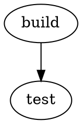

# The dagreach attribute profile

dagreach does not define a graph format. It reads two that already exist —
[DOT](https://graphviz.org/doc/info/lang.html) and
[JSON Graph Format](https://jsongraphformat.info/) — and gives a meaning to four attribute names
when they happen to be present.

Everything here is **optional**. A graph carrying none of these attributes still gets every
structural answer; only the weighted ones change.

## The four names

| Attribute | Applies to | Meaning | Read as |
|---|---|---|---|
| `duration` | node, edge | how long this step takes, in any unit you choose consistently | a number |
| `weight` | node, edge | fallback for `duration`, for graphs that already use this name | a number |
| `status` | node | lifecycle state, free text (`ready`, `failed`, `skipped`, …) | trimmed text |
| `group` | node | a grouping used for rollups (team, layer, phase, …) | trimmed text |

### Precedence and tolerance

- `duration` wins over `weight`. If `duration` is present but unreadable, `weight` is used.
- A value that is not a finite number (`nan`, `inf`, `later`, `2 days`) is **ignored, never
  guessed**, and reported as a warning by `dagreach parse`. The graph still loads.
- `status` and `group` are trimmed; a blank value counts as absent.
- Units are yours. dagreach never converts, so keep one unit per graph — mixing seconds and
  minutes silently produces a meaningless critical path.

## Where the attributes go

In DOT, they are ordinary attributes, and Graphviz defaults apply as usual:



Inherited defaults never overwrite a value a node states explicitly.

In JSON Graph Format, they live in `metadata` (and are also read from the node object itself):

```json
{
  "graph": {
    "nodes": [
      { "id": "build", "metadata": { "duration": 30, "status": "done", "group": "core" } },
      { "id": "test", "metadata": { "duration": 120, "status": "running" } }
    ],
    "edges": [{ "source": "build", "target": "test" }]
  }
}
```

## What dagreach does with them

| Attribute | Used for |
|---|---|
| `duration` / `weight` | the weighted critical path, and the cost of an impacted set |
| `status` | filtering and reporting; it never changes the structure |
| `group` | rollups: impact and diff results summarised per group |

Without durations, the critical path is measured **in edges**, and every dagreach output that
reports one says which of the two it is. An unweighted number is never presented as a duration.

## Checking what was understood

```console
$ dagreach parse pipeline.json
pipeline.json: jgf 'etl_daily', directed, 5 nodes, 4 edges
profile: durations on 4/5 nodes, 3 status value(s), 3 group(s)
```

Add `--json` for the machine-readable form. Anything the reader had to work around — a collapsed
parallel edge, an undeclared endpoint, an unreadable duration, a non-standard spelling — appears
as a warning rather than being absorbed in silence.
